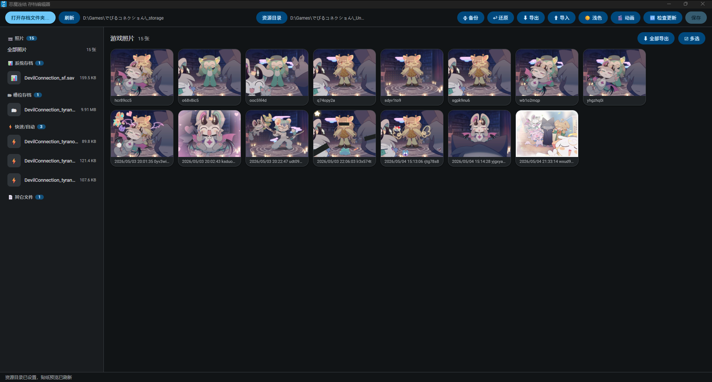
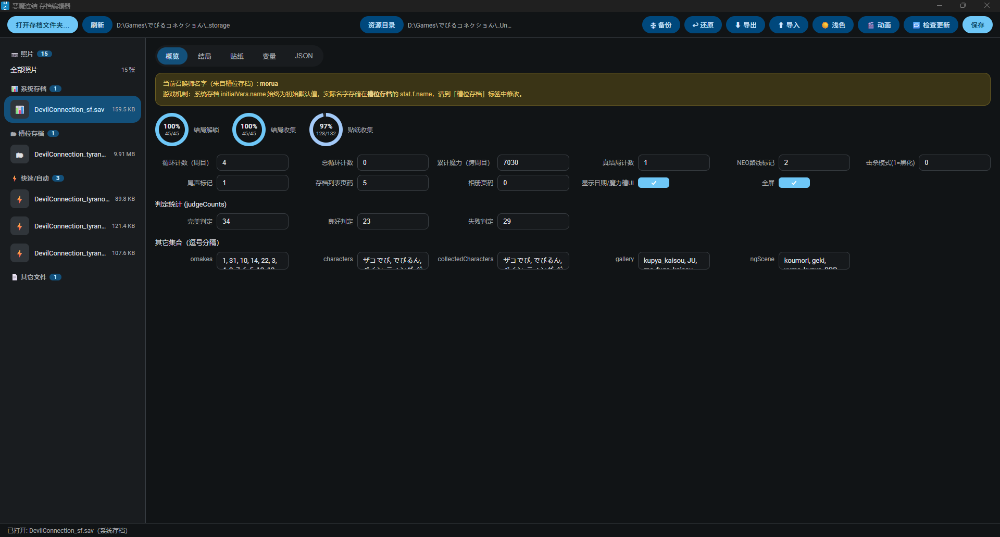
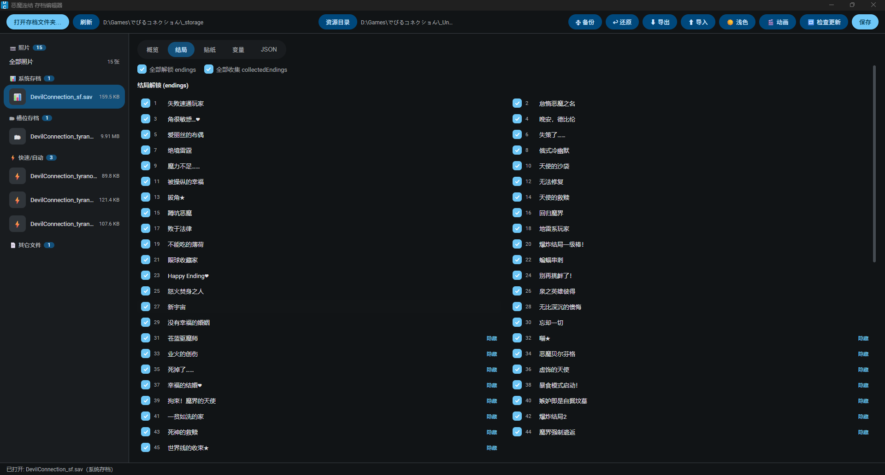
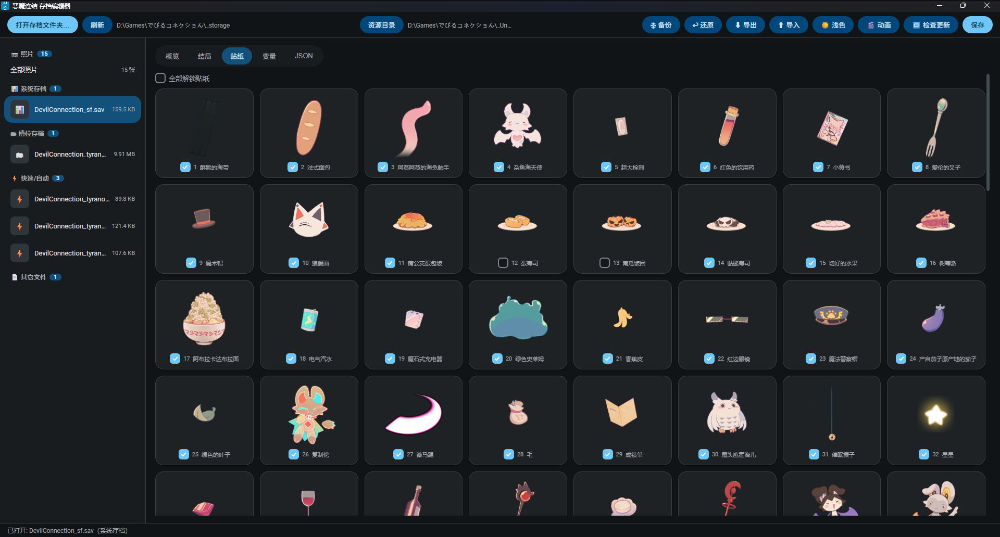
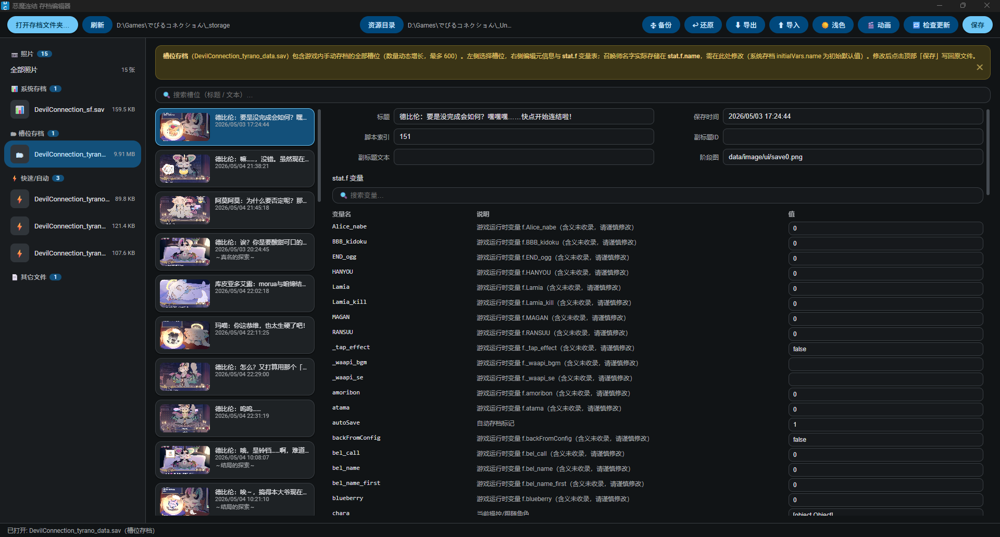

# 恶魔连结存档编辑器 (DC-SaveEditor)

为《でびるコネクション》(Devil Connection) 游戏制作的存档编辑器，支持 **Tauri** 与 **Electron** 双平台运行，一套前端两套壳。

## 软件展示

| | |
|:---:|:---:|
|  |  |
|  |  |
|  | |

## 快速开始
- **注意**!本软件仅在1.0版本测试过，可能有兼容性问题
- **安装**：下载安装包，根据安装器指引安装到游戏目录下的任意空文件夹
- **预览图**：为了预览贴纸等游戏原版资源，你可以解包数据提取（非必要）；我们提供了提取好的资源压缩包，下载后将压缩包中的文件解压到游戏根目录下（请不要让压缩软件自动生成文件夹）
- 正确路径
```
|
⺊ 游戏文件......
⺊ data/  //资源目录
⺊ DC-SaveEditor/  //软件目录

```

## 功能

- **系统存档**编辑：概览字段、结局图鉴解锁/收集、贴纸解锁、全局变量表、原始 JSON 编辑
- **槽位存档**（数量动态增长，最多 600）与**快速/自动存档**编辑：标题、保存时间、脚本索引、副标题、阶段图；召唤师名字存储在 `stat.f.name`
- **槽位变量说明**：`stat.f` 关键变量带悬停说明（名字、天数、魔力、周目、各角色/道具标记等），未知变量提示谨慎修改；顶部提示条可一键关闭并记住选择
- **游戏照片**预览与导出（dataURL 存档解码）
- 从游戏解包资源自动提取**贴纸**、**阶段图**、**附加内容（相册/NGC）**缩略图预览
- **多语言**：基于 `lang_*.json` 的本地化框架（内置英文/日文，检测到文件即显示语言切换下拉）
- UI：Android 15 / Material 3 风格、主题色 `#1585C0`、深色模式、WinUI3 风格圆角复选框、磁吸式选项卡、可开关动画

## 运行

前置：Node.js + npm；Rust 工具链（仅 Tauri 需要）。

### Electron

```bash
npm install
npm start
```

### Tauri

```bash
cd src-tauri
cargo run
```

两种方式共用 `dist/` 前端，运行时由 `dist/api.js` 自动识别 `window.__TAURI__` 或 `window.electronAPI` 选择后端。

## 存档目录

游戏存档位于游戏根目录的 `_storage` 文件夹。程序按以下顺序自动定位：

1. 从应用所在目录向上查找 `_storage`
2. 环境变量 `DC_GAME_ROOT` 指定的游戏根目录下的 `_storage`（推荐，代码不硬编码本机路径）

```powershell
$env:DC_GAME_ROOT = "你的游戏根目录"
```

也可以在界面点击「打开存档文件夹」手动选择。

## 本地化 / 多语言

程序内置一套轻量本地化框架：**界面文本以「中文原文 → 译文」的键值对存放于 `dist/lang_<code>.json`**。启动时会探测这些文件，只要检测到任意语言文件就显示右上角语言切换下拉，否则不显示。

已内置并在 Release 中提供的文件：

| 文件 | 语言 |
|------|------|
| `lang_en.json` | English（英文） |
| `lang_ja.json` | 日本語（日文） |

支持的语言代码（`I18N_CODES`）目前有：`en` / `ja` / `ko` / `zh-Hant`。

### 如何添加 / 自建翻译

1. 打开任意现有语言文件（如 `lang_ja.json`）作为模板。
2. 复制并重命名为 `lang_<code>.json`（`<code>` 取 `en`/`ja`/`ko`/`zh-Hant` 之一；若想新增其它语言，需在 `dist/renderer.js` 的 `I18N_CODES` 数组中追加 `{ code, name }`）。
3. 保持 JSON 的 **key 不变**（为界面中的中文原文），只需把 **value** 改为对应译文：

   ```json
   {
     "打开存档文件夹…": "Open Save Folder…",
     "概览": "Overview",
     "保存": "Save"
   }
   ```

4. 将文件放入 `dist/`（随安装包一起打包；Exe 安装版开箱即用）。也可以直接替换应用安装目录下 `resources/` 里的同名文件进行热更新（无需重新打包）。
5. 启动程序后右上角语言下拉即可看到你的语言并切换。

> 说明：翻译仅覆盖**静态界面文本与输入框占位符**（原生 HTML 中文原文）。图鉴数据（结局/贴纸/角色名等，来自游戏数据 `data.js`）与提示/状态信息属于运行期动态文本，保留原文。如需完整覆盖请自行扩展 `applyI18n` 逻辑——只需让 `lang_*.json` 的 key 与动态插入的文本完全一致即可生效。

## 构建安装包

```bash
npm install            # 安装 @tauri-apps/cli
npx tauri build
```

产物位于 `src-tauri/target/release/bundle/`（Windows 下为 NSIS 安装包）。

## 项目结构

```
dist/        前端（index.html / style.css / renderer.js / api.js / data.js / lang_*.json）
electron/    Electron 主进程与预加载脚本
src-tauri/   Tauri Rust 后端与配置
```

## 相关项目

- [Hxueit/Devil-Connection-Sav-Manager](https://github.com/Hxueit/Devil-Connection-Sav-Manager)：Python 版《でびるコネクショん》存档管理器（备份/还原、槽位增删改排、运行时修改等，功能更全）。本项目受其「为结局/贴纸等提供取值说明列表」的启发，为槽位 `stat.f` 变量补充了悬停说明；两者为独立项目，未复用其代码。

## 技术栈

- Tauri 2 (Rust) / Electron 22
- 原生 Web 前端（HTML/CSS/JS），Material 3 风格

## 免责声明

修改存档可能影响游戏进度，请提前备份 `_storage` 目录。本工具仅供学习交流使用。

## 许可证：
GPL v3.0
